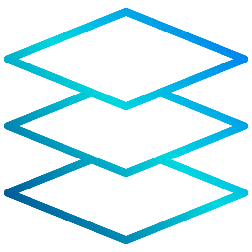
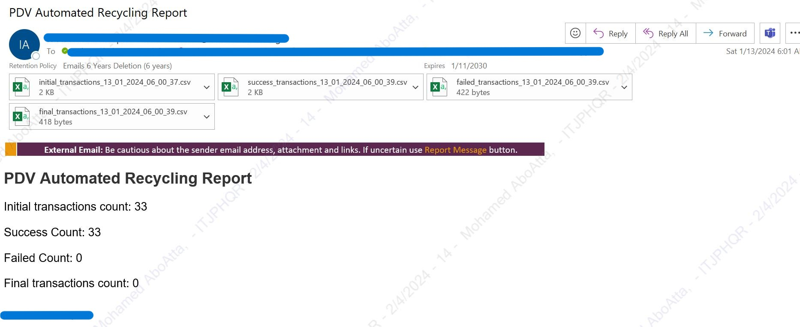

[![LinkedIn][linkedin-shield]][linkedin-url]

<!-- PROJECT LOGO -->
 

  
  <h3 align="center">Automated Prepaid Number Recycling for SFID Resolution</h3>

<!-- TABLE OF CONTENTS -->

  
Table of Contents

  <ol>
    <li>
      <a href="#about-the-project">About The Project</a>
      <ul>
        <li><a href="#business-case">Business Case</a></li>
        <li><a href="#technical-solution">Technical Solution</a></li>
        <li><a href="#tech-stack">Tech Stack</a></li>
      </ul>
    </li>
    <li><a href="#contact">Contact</a></li>
  </ol>

<!-- ABOUT THE PROJECT -->
## About The Project

* **Project Name:** Automated Prepaid Number Recycling for SFID Resolution  
* **Version:** v1.0.0  
* **Department:** Technology

---

### Business Case

The project addresses the automation of recycling prepaid numbers to resolve issues related to SFID (Subscriber Fixed Identity). After the recycling process, some transactions fail, impacting new customers when purchasing a new line. The goal of this project is to automate the resolution of these SFID issues and ensure that new customer experiences are not affected by failed transactions.

(<a href="#readme-top">back to top</a>)

### Technical Solution

The project involves a backend automation process that extracts transactions with SFID issues from the MNP (Mobile Number Portability) database. The system runs an update statement for each transaction, resolving the SFID issues efficiently.

(<a href="#readme-top">back to top</a>)

### Tech Stack

This project was developed using the following tech stack:

* **Python**

(<a href="#readme-top">back to top</a>)

<!-- CONTACT -->
## Contact

Mohamed AbdelGawad Ibrahim - [@m-abdelgawad](https://www.linkedin.com/in/m-abdelgawad/) - <a href="tel:+201069052620">+201069052620</a>

(<a href="#readme-top">back to top</a>)

<!-- MARKDOWN LINKS & IMAGES -->
[linkedin-shield]: https://img.shields.io/badge/-LinkedIn-black.svg?style=for-the-badge&logo=linkedin&colorB=555
[linkedin-url]: https://www.linkedin.com/in/m-abdelgawad/
